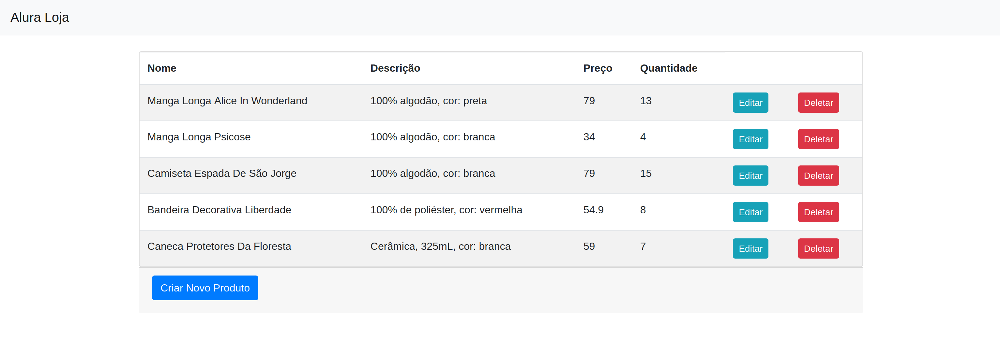

# Go: Crie uma Aplicação Web

:woman_technologist: <strong>Curso:</strong> [Alura](https://www.alura.com.br/curso-online-go-lang-web)

:page_facing_up: [Certificado](https://cursos.alura.com.br/certificate/73e2aa59-8498-457a-aec0-5f5aebfb3dd8)

 

### Aprendizados:

- Servidor e struct de produtos
- Conectando com banco de dados (postgresql)
- Refatoração e página de novos produtos
- Deletando produtos e partials
- Atualizando e editando produtos

 

### Resultado:

**Página Inicial:**

**Criando um novo produto:**

**Editando um produto:**

**Excluindo um produto:**

